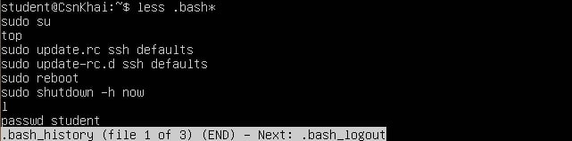
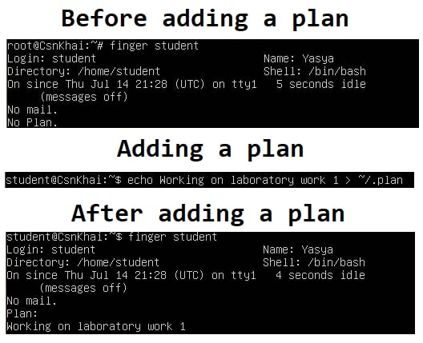

# Task1.Part1 
## 1) Log in to the system as root.  
```console
##switch to administrator without changing the current directory
student@CsnKhai:~$ sudo -s
#switch to admin (#)
student@CsnKhai:~$ sudo su
```
## 2) Use the passwd command to change the password. Examine the basic parameters of the command. What system file does it change?
```bash
#change user password
passwd user_name
#basic parameters 
#delete user password
-d
#make the password obsolete
-e
#lock the account if the user has not changed the password in n days
-i n 
#the maximum number of days n that the user's password is valid
-x n
#the number of days n after which to display a message about the need to change the password 
-w n 
```
The passwd command changes some of the entries in the /etc/passwd file.

## 3) Determine the users registered in the system, as well as what commands they execute. What additional information can be gleaned from the command execution?
```bash
Use w command to provide a list of currently active users or ps -ef | grep ^username to see commands a user is running.
```


## 4) Change personal information about yourself.
```bash
#change personal information displayed by finger
chfn
#change your login shell
chsh
#change the user's password
passwd
```

## 5) Become familiar with the Linux help system and the man and info commands. Get help on the previously discussed commands, define and describe any two keys for these commands. Give examples. 
```bash
Command info gives more detailed information about the command rather than man.
```

```console
#Usage of man:
student@CsnKhai:~$ man passwd
#Usage of info:
student@CsnKhai:~$ man passwd

#Part of result:
-a, --all
           This option can be used only with -S and causes show status
           for all users.

-d, --delete
           Delete a user`\`s password (make it empty). This is a quick way
           to disable a password for an account. It will set the named
           account passwordless.

```

## 6) Explore the more and less commands using the help system. View the contents of files .bash* using commands. 
```console
#Usage of help to find out what command about:
student@CsnKhai:~$ less --help
```
```console
#Usage of less:
student@CsnKhai:~$ less .bash*
```


```console
#Usage of more:
student@CsnKhai:~$ more .bash*
```


## 7) * Describe in plans that you are working on laboratory work 1. Tip: You should read the documentation for the finger command. 


## 8) * List the contents of the home directory using the ls command, define its files and directories. Hint: Use the help system to familiarize yourself with the ls command.


# Task1.Part2 
## 1) Examine the tree command. Master the technique of applying a template, for example, display all files that contain a character c, or files that contain a specific sequence of characters. List subdirectories of the root directory up to and including the second nesting level.
```bash
Calling tree comand
```


```bash
Displaying all files that contain a character c
```


```bash
Displaying all files that contain a specific sequence of characters ("pla") 
```


```bash
List subdirectories including the 2nd nesting level
```


## 2) What command can be used to determine the type of file (for example, text or binary)? Give an example. 
```console
#file command with -b option uses to show just the file type pass.
student@CsnKhai:~$ file -b file.txt
```
## 3) Master the skills of navigating the file system using relative and absolute paths. How can you go back to your home directory from anywhere in the filesystem? 
```console
#To go back to the home directory
student@CsnKhai:~$ cd ~
```

## 4) Become familiar with the various options for the ls command. Give examples of listing directories using different keys. Explain the information displayed on the terminal using the -l and -a switches. 
```bash
ls directory_name - display the contents of the directory
Main keys:
-a displaying information about all files, including hidden ones
```


```bash
-t sorting the displayed list by time
```


```bash
-R displaying the list recursively by subdirectories
```


```bash
-l displaying information about files in long format
Long format includes:
The first column gives the type of the file (directory or file) and the file permissions.
The second column is the number of links to the file.
The third and fourth columns are the user who owns the file and the Unix group of users to which the file belongs.
The fifth column is the size of the file in bytes.
The next three columns are the time at which the file was last changed.
The last column is the name of the file.
```


## 5) Perform the following sequence of operations: 
```console
#create a subdirectory in the home directory; 
student@CsnKhai:~$ mkdir files
#in this subdirectory create a file containing information about directories located in the root directory;
root@CsnKhai:~# ls -a /root/ 1>files/info.log
#view the created file; 
```


```console
#copy the created file to your home directory using relative and absolute addressing.
```


```console
#delete the previously created subdirectory with the file requesting removal;
```


```console
#delete the file copied to the home directory. 
```


## 6) Perform the following sequence of operations: 
```console
#create a subdirectory test in the home directory;
student@CsnKhai:~$ mkdir test
#copy the .bash_history file to this directory while changing its name to labwork2; 
student@CsnKhai:~$ cp .bash_history test/labwork2
#create a hard and soft link to the labwork2 file in the test subdirectory; 
```


```console
#how to define soft and hard link, what do these concepts; 
A soft (symbolic) link is an actual link to the original file, whereas a hard link is a mirror copy of the original file.
If you delete the original file, the soft link has no value, because it points to a non-existent file.

#change the data by opening a symbolic link. What changes will happen and why 
- rename the hard link file to hard_lnk_labwork2; 
- rename the soft link file to symb_lnk_labwork2 file; 
- then delete the labwork2. What changes have occurred and why? 